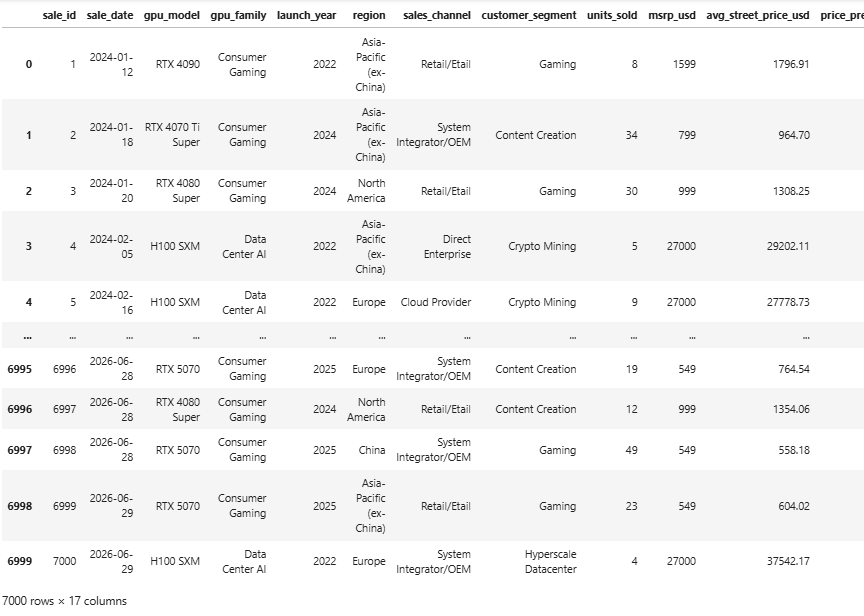
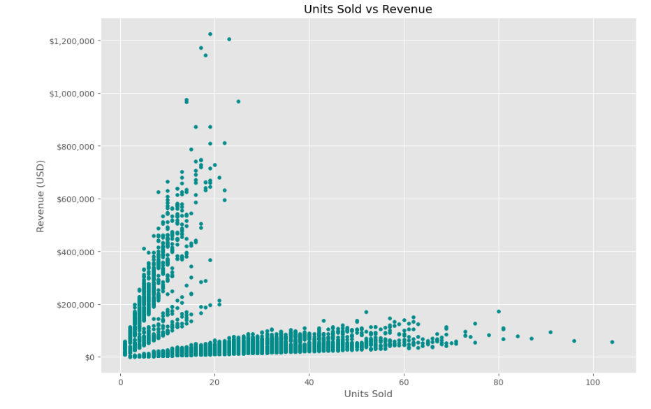
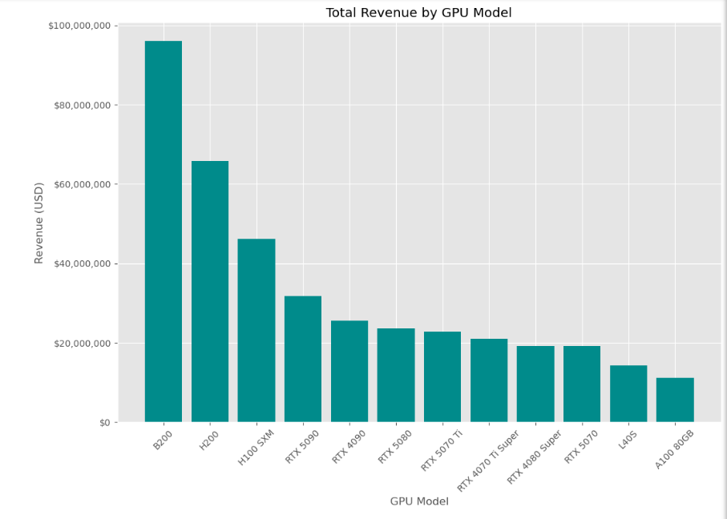
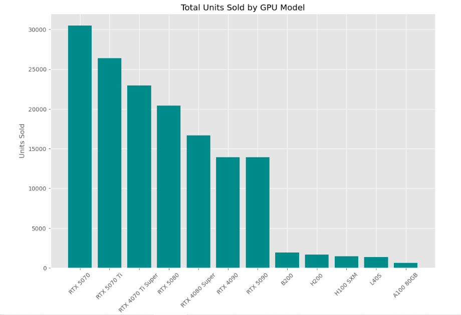
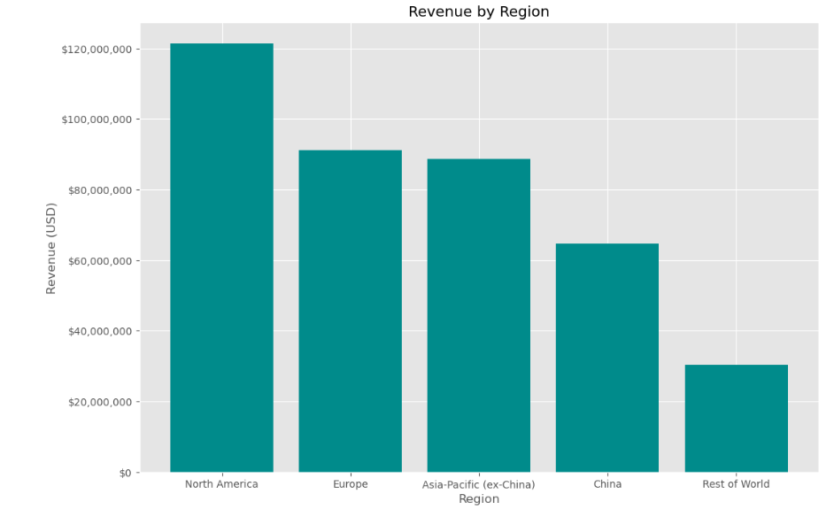
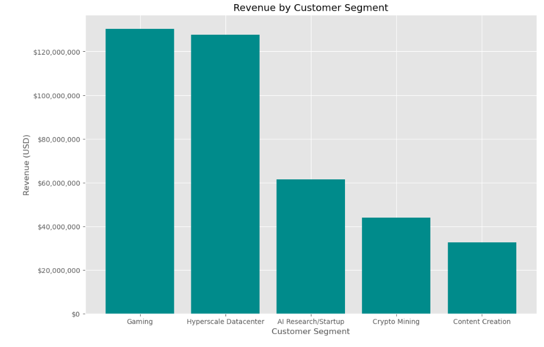
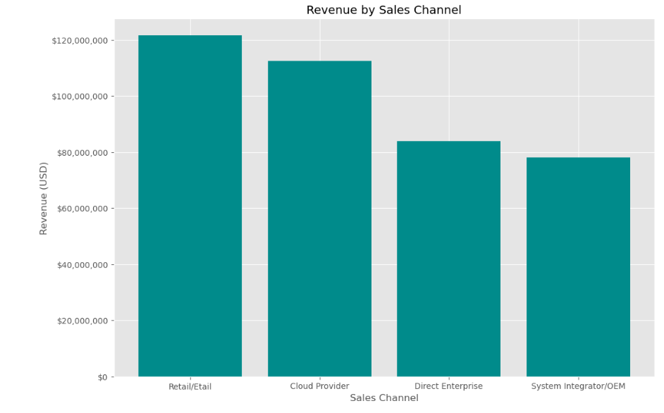
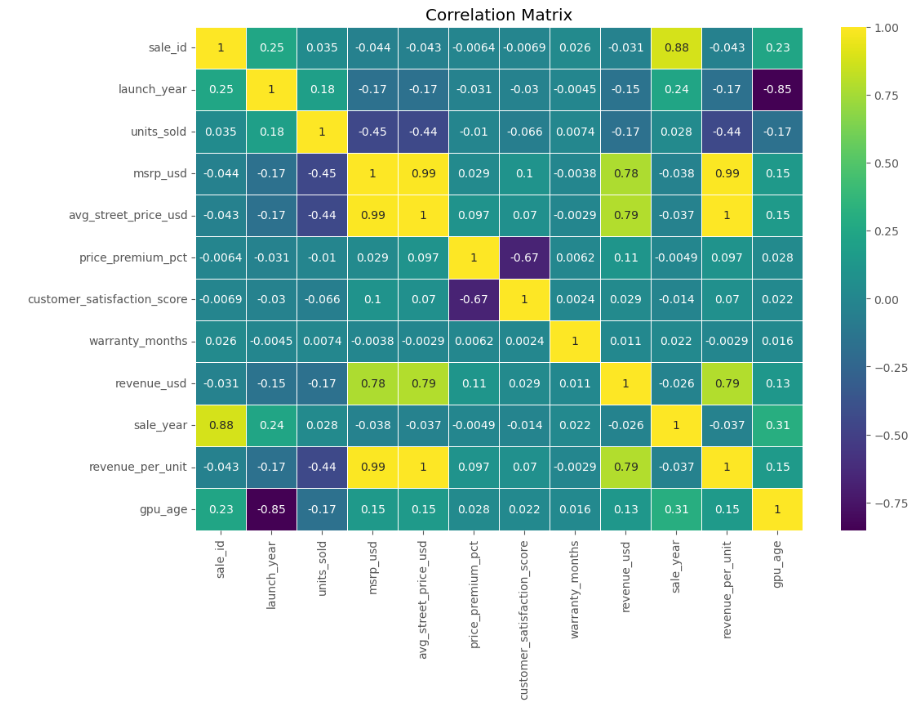

# Python GPU Sales
#### Python project demonstrating data cleaning, exploratory data analysis, statistical analysis, feature engineering, and data visualisation using GPU sales data.

## Contents   
- [Purpose](#purpose)  
- [Objectives](#objectives)  
- [Skills](#skills)  
- [Key Insights](#key-insights)  
- [Visualisations](#visualisations)  
- [Previews](#cleaned-table-preview)   
- [Final Project](#final-project)  
  
## Purpose
I created this project to demonstrate my Python and data analysis skills by exploring a synthetic dataset of NVIDIA GPU sales. The analysis especially investigates sales performance, revenue, customer segments, regions, and GPU models.

## Objectives
-Analyse factors contributing to overall revenue.  
-Investigate the relationship between units sold and revenue.  
-Compare revenue across GPU models, regions, and customer segments.  
-Identify patterns and trends within the sales data.  
-Create derived columns to support further analysis.  
-Use data visualisations to communicate key findings.  
-Draw conclusions and recommendations from the analysis.  

## Skills 
Technical skills: Python, Pandas, NumPy, For loops, Data cleaning and preparation, Data type manipulation,  
Missing-value analysis, Exploratory Data Analysis (EDA), Feature engineering, Derived columns,  
Data aggregation and grouping, Statistical analysis, Data visualisation with Matplotlib.  
  
Soft skills: Interpreting analytical results, Communicating insights and recommendations.

## Key Insights
Key insights I gathered from the analysis were:  
Units Sold has a positive relationship with Revenue, although the relationship is not completely linear, suggesting that other factors also affect Revenue.  
GPU Model also has a significant impact, with the B200 generating the highest Revenue, followed by the H200, H100 SXM, RTX 5090 and RTX 4090.   
The models generating the most Revenue were not always those with the highest Units Sold, suggesting that pricing and product demand may also contribute.   
North America generated the highest Revenue, followed by Europe and Asia, while Gaming and Hyperscale Datacenters were the highest-revenue Customer Segments. Retail/E-tail and Cloud Provider were also the highest-revenue Sales Channels.  
Furthermore, in a professional setting I would investigate these results further to understand why they were produced. I would look at factors such as pricing, Units Sold, Revenue per Unit, customer behaviour and profit margins to determine what is responsible for the differences in Revenue.

## Visualisations  
-Units Sold vs Revenue  
-Total Revenue by GPU Model  
-Total Units Sold by GPU Model  
-Revenue by Region  
-Revenue by Customer Segment  
-Revenue by Sales Channel  
-Correlation Matrix  
 
## Table Preview  
  
  

## Chart Previews  
  

  

  

  

   

  

  

## Final Project
**[Go to Final Project](./GPU_Sales_Analysis.ipynb)**

###### Original dataset available in repository
